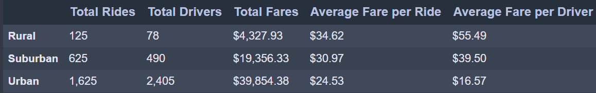

# PyBer_Analysis
## Overview of the analysis:
The purpose of this analysis was to create a summary DataFrame of ride sharing by city type then plotting the data to a multi-line graph. 
## Results:
After grouping the cities by type we counted the number of rides, drivers and the sum of fares for each. We then generated a DataFrame containing all the values.



We can see that the total fares increase with city size and that the average fare per ride is inversely proportional to city size. 

Next, we used the `groupby` function on `type` and `date` to generate a DataFrame of fare sum. We use the `pivot` function to bring the `date` as the index in a new DataFrame. We needed to convert the `date` to a `datetime` data type to use with the `resample` function to generate the sum of fares for each week.

```
fare_jan_apr_new = fare_sum_pv_jan_apr.resample('W').sum()
fare_jan_apr_new.tail()
```
Using the weekly fare data, we plotted a line graph for each city type.


## Summary:
According to this analysis, we can make three recommendations to PyBer to address disparities between city types.

•	Since most revenues come from more densely populated urban cities, PyBer could consider giving a bigger share of the fare to the drivers. This could be an incentive to retain drivers and attract new ones. With more drivers, wait time would be shorter and more people might use their service.

•	In rural cities, PyBer could consider reducing the fee per kilometers since longer distance are traveled. If the fare is too high, potential client might ask a friend for a ride for lower fee instead of using PyBer.

•	Pyber could offer a scheduled ‘bus type’ service for rural area and help reducing the fare cost for customers.

After implementing the changes, we can perform another analysis to see the effects on ridership and revenues.
